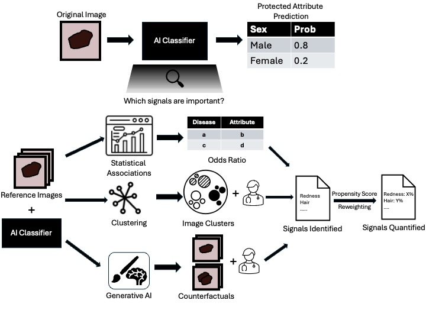

# Towards a framework for discovering mechanisms underlying AI prediction of protected attributes

This repository provides code and step-by-step instructions to execute the framework introduced in the paper "Towards a framework for discovering mechanisms underlying AI prediction of protected attributes", as shown in the figure below.



## Installation
1. Git clone this repository
2. ```cd protected-attrib-predicition```
3. Create and activate the specified conda environment by running

```
conda env create -f environment.yml
conda activate protected-attrib-prediciton-env
```
4. Install the protected-atttrib-prediction package and necessary dependencies for development by running ```pip install -e ".[dev]"```

## Set up directory paths
Create the following environment variables for the base directory to the datasets and the output directory to store the trained models.

```bash
export BASE_DIR_CHEXPERT=<PATH_TO_CHEXPERT_DIR>
export BASE_DIR_MIMIC=<PATH_TO_MIMIC_DIR>
export BASE_DIR_ISIC=<PATH_TO_ISIC_DIR>
export OUT_DIR=<PATH_TO_OUTPUT_DIR>
```

Add the repo directory to PYTHONPATH:

```bash
export PYTHONPATH="$PYTHONPATH:src"
```

## Datasets
We analyse two modalities in this work: dermatology and radiology.

### Dermatology
For the dermatology domain, we used the images from the 2019 and 2020 ISIC challenge dataset with demographic information available. These can be downloaded from https://challenge.isic-archive.com/data/.

### Radiology
For the radiology domain, we used the CheXpert dataset for training and the MIMIC-CXR dataset for testing. 

The CheXpert dataset can be downloaded from https://stanfordaimi.azurewebsites.net/datasets/8cbd9ed4-2eb9-4565-affc-111cf4f7ebe2 after creating a Stanford AIMI account. The race labels for CheXpert can be obtained from https://stanfordaimi.azurewebsites.net/datasets/192ada7c-4d43-466e-b8bb-b81992bb80cf.

The MIMIC-CXR dataset can be downloaded from https://physionet.org/content/mimic-cxr-jpg/2.1.0/ after completeing the required training and signing the data use agreement. 

To preprocess the race labels, run the `notebooks\get_cxr_race_labels.ipynb` jupyter notebook.

## Running the framework

### Step 1: Train the classifiers for protected attribute prediciton
To train the dermatology classifiers across five seeds, run the following command

```bash
bash scripts/train_derm.sh
```

To train the radiology classifiers across five seeds, run the following command

```bash
bash scripts/train_cxr.sh
```

The bash scripts indicate the different editable arguments usedfor training. The trained classifiers will get saved to `$OUTDIR/{modality}_{seed}.pt`

To generate the predictions from the trained classifiers for the test set, run the following command:

```python
python scripts/generate_predictions.py \
    --dataset_class ISICSexDataset \  # Class name of the dataset to use
    --dataset [derm | cxr]  \         # Modality to use
    --device cuda                     # The GPU device to use
```

### Step 2: Identifying potentially important signals

#### Statistical Analysis
To analyse the statistical associations between the metadata attributes and the protected attributes, run the following command:

```python
python scripts/statistical_analysis.py \
    --dataset [derm | cxr]                     # Modality to use
    --task [diagnosis | age | dermoscopy_type] # Which attribute to run the statistical analysis on
```

#### Clustering

To run the clustering algorithm on the datasets, run the following command:

```python
python scripts/clustering.py \
    --dataset [derm | cxr]  \                 # Modality to use
    --clf_ckpt  /path/to/classifier/ckpt \    # Path to the trained classifier checkpoint from Step 1
    --featurized_path [Optional]  \           # Path to the ResNet features from the dataset
    --device cuda                             # The GPU device to use
```

#### StyleGAN Latent Space Optimization
To get counterfactuals using the latent space optimization, the first part is to fine-tune a StyleGAN model using domain-specific images. This can be done by following the steps in https://github.com/NVlabs/stylegan2-ada-pytorch. Specifically, run the following commands:

```python
# Create the dataset zip file
python dataset_tool.py \
--source /path/to/all/images \ # Path to the source images
--dest /path/to/destination    # .zip path to store the zipped images
```
```python
# Train the StyleGAN
python train.py \
    --data /path/to/zipped/file \          # Path to the zipped file from the previous command
    --outdir /path/to/output/directory \   # Output directory to store the trained models
    --gpus=4 \                             # Number of GPUs to use 
```

Once the StyleGAN is trained, run the latent space optimization using the following command:

```python
python scripts/latent_space_opt.py \
    --stylegan_pkl_path path/to/trained/stylegan \ # path to .pkl file with the trained StyleGAN
    --dataset [derm | cxr]  \                      # Modality to use
    --device cuda                                  # The GPU device to use
```
The counterfactuals will be saved under the `/data/opt_images_{modality}`.

#### Explanation by Progressive Exaggeration (EBPE)
To train the EBPE model, run the following command:

```python 
python scripts/train_ebpe.py \
    --save_path /path/to/save/ebpe/model \  # Path to the .pkl file to save the trained EBPE model
    --dataset [derm | cxr]  \               # Modality to use
    --device cuda                           # The GPU device to use
```

Once the EBPE model is trained, generate the counterfactuals using the following command:
```python
python scripts/generate_ebpe.py \
    --ckpt_path /path/to/saved/model \  # Path to the trained model from the previous command
    --max_images 100 \                  # Maximum number of counterfactual images to generate
    --dataset [derm | cxr]  \           # Modality to use
    --device cuda                       # The GPU device to use
```

### Step 3: Analysing the counterfactuals
Once the counterfactuals are generated, they can be analysed to identify potentially important signals. This can be done manually or by using a web-app interface as mentioned in the paper. A demo of the web-app is provided in the `/web_app_demo` directory with 10 counterfactua pairs which can be run locally using the commands:

```
cd web_app_demo/
python application.py
```

**NOTE:** The images in `web_app_demo/images/` should be updated to the generated counterfactuals. The corresponding ids also need to be updated in `web_app_demo/static/images.js` backend used was dynamodb, so the table would need to be setup in AWS and updated `web_app_demo/application.py`.

### Step 4: Quantification using inverse propensity treatment weighting (IPTW)
To run IPTW, we first need to get labels for each of the identified signals. To do that, we first manually label ~1000 images with the signals identified. Then we train a classifier for each of the signals and use that to label the rest of the test set. To train and label the classifiers across multiple signals, run the following command:

```python
python scripts/train_signal_classifier_and_annotate.py \
    --manual_labels_path /path/to/the/manual/labels \ # path to a .csv file containing the binary labels.
    --signals signal_1 signal_2 ... \                 # list of signals to train the classifiers for
    --training_type [classfication | regression] \    # type of training task
    --nepochs 30 \                                    # number of epochs to train the classifier for
    --dataset [derm | cxr]  \                         # Modality to use
    --device cuda                                     # The GPU device to use
```

The labels will get saved at `data/{modality}_annotated_all_images.csv`

Once the labels are generated for all signals, to quantify them using iptw, run the following command:

```python
python scripts/iptw.py \
    --signals signal_1 signal_2 ... \   # list of signals to train the classifiers for
    --dataset [derm | cxr]  \           # Modality to use
```

The quantification values will get saved to `data/{modality}_iptw_quantification.csv`.